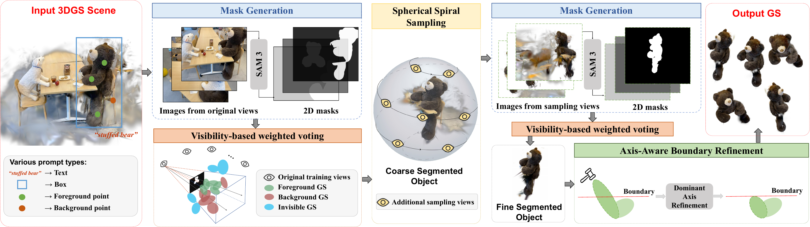

# VCAR

Official implementation of *VCAR: Training-Free 3DGS Segmentation via View
Completeness and Axis-Aware Boundary Refinement*, accepted by ACM Multimedia
2026 (ACM MM 2026).

**Paper:** [arXiv:2608.30870](https://arxiv.org/abs/2608.30870)

VCAR segments objects from an already trained 3D Gaussian Splatting (3DGS)
scene without additional training.

## Framework

[](assets/vcar_framework.png)

*Overview of the VCAR framework. Click the figure to view it at full resolution.*

ABR axis attribution retains the complete first-order pinhole perspective
coupling. It removes only the depth factor shared by all three local axes,
while recovering normalized image coordinates from the projected Gaussian
center and camera intrinsics.

## Repository layout

```text
VCAR/
├── seg_iter_gradio.py              # Interactive segmentation interface
├── sam3_segment_api.py             # SAM3 service copied during installation
├── seg_utils/                       # VCAR segmentation pipeline
├── eval_utils/
│   ├── run_lerf_ovs.py             # LERF-OVS reproduction and evaluation
│   ├── run_nvos.py                 # NVOS reproduction and evaluation
│   └── evaluate_2d_masks.py        # 2D mask metrics
├── configs/
│   ├── lerf_ovs/                   # LERF-OVS prompts and parameters
│   └── nvos/                       # NVOS prompts and parameters
└── data/                           # Download LERF-OVS/NVOS package below
```

## Installation

Follow [Install.md](Install.md). The tested environment uses Python 3.12,
CUDA 11.8, PyTorch 2.7.0, SAM3, and the official Gaussian Splatting
implementation.

The development versions are based on:

- [facebookresearch/sam3](https://github.com/facebookresearch/sam3), commit
  `a51b9f498c84824a94702cc289ed75d9cc544c64`.
- [graphdeco-inria/gaussian-splatting](https://github.com/graphdeco-inria/gaussian-splatting),
  commit `54c035f7834b564019656c3e3fcc3646292f727d`.

## Quick Start

### 1. Prepare a trained 3DGS scene

If the scene has already been reconstructed and trained, use it directly. The
model directory must contain:

```text
<model_path>/
├── cfg_args
└── point_cloud/
    └── iteration_30000/
        └── point_cloud.ply
```

You also need the original scene directory referenced during 3DGS training,
including its RGB images and COLMAP reconstruction.

If no trained model is available, train one with the bundled official Gaussian
Splatting code:

```bash
conda activate VCAR
cd /path/to/VCAR
python gaussiansplatting/train.py \
    -s /path/to/source-scene \
    -m /path/to/trained-3dgs-output
```

VCAR uses the iteration 30000 model produced by the default training command.

### 2. Start the SAM3 service

Open the first terminal:

```bash
conda activate VCAR
cd /path/to/VCAR/sam3
python sam3_segment_api.py
```

The service runs at `http://localhost:8000`. Keep it running while using VCAR.

### 3. Start the segmentation interface

Open a second terminal:

```bash
conda activate VCAR
cd /path/to/VCAR
export PYTHONPATH="$PWD:$PWD/gaussiansplatting:$PYTHONPATH"
python seg_iter_gradio.py
```

Open `http://localhost:7860`, then:

1. enter the trained model path and its original source scene path.
2. load the training views and select an annotation frame.
3. annotate the object with text, foreground/background points, or a box.
4. run the two-round segmentation pipeline.
5. optionally adjust the voting threshold or apply outlier filtering and
   Axis-Aware Boundary Refinement.

Paths can also be supplied as startup defaults:

```bash
export VCAR_DEFAULT_MODEL_PATH="/path/to/trained-3dgs-output"
export VCAR_DEFAULT_SOURCE_PATH="/path/to/source-scene"
export VCAR_ALLOWED_PATHS="/path/to/models:/path/to/scenes"
python seg_iter_gradio.py
```

`VCAR_ALLOWED_PATHS` is a colon-separated list of directories that Gradio may
serve. It is useful when models and source scenes are outside the project
directory.

Each run creates a timestamped directory under the model path. Important
outputs include:

```text
<model_path>/<object_name>-YYYY-MM-DD-HH-MM/
├── coarse.ply
├── fine.ply
├── segment.ply
├── background.ply
├── compression.ply
├── segmentation_params.json
├── eval_mask_comparison.png
├── eval_rgb_comparison.png
├── eval_comparison.png
├── sam_frame_mapping.json
├── sam_frame_mapping_round1.json
├── sam_frame_mapping_round2.json
├── render_segment/
└── render_mask_segment/
```

`segment.ply` always contains the latest foreground result.
The evaluation runners save aligned Mask and RGB diagnostics as
`eval_mask_comparison.png` and `eval_rgb_comparison.png`. The RGB figure shows
the source image, source RGB cropped by the GT Mask on a white background, and
the segmented 3DGS render, in that order. In the Mask error row, true positives
are green, false positives are red, and false negatives are blue.
`eval_comparison.png` remains a compatibility copy of the Mask figure.
`sam_frame_mapping.json` points to the latest round's mapping, while the
round-specific manifests preserve each renumbered SAM frame's original
training or spherical camera index. `segmentation_params.json` records the
configured view-visibility threshold (the CSV and Gradio default is 1%) and
the exact frame and mask indices removed in each round. The Round 2 mapping
file is absent when Round 2 is skipped.
ABR fails closed when a legacy output has no mapping manifest; the Python API
offers `allow_legacy_positional_alignment=True` only for outputs that have
been independently audited and are known not to contain a filtered training
frame.

## Benchmark reproduction

Download the combined
[VCAR LERF-OVS and NVOS benchmark package from Google Drive](https://drive.google.com/drive/folders/1g7k9FrohbMRiE1hOBcpCj46nEJyY5hUg?usp=drive_link).
The package starts from trained iteration 30000 3DGS models. Place or extract
the two downloaded directories under `data/` as:

```text
data/
├── lerf_ovs/
└── nvos/
```

The data directories include their own README files with layouts, provenance,
and annotation details. Prompt and parameter fields are documented in
[configs/lerf_ovs/README.md](configs/lerf_ovs/README.md) and
[configs/nvos/README.md](configs/nvos/README.md).

### LERF-OVS

The curated VCAR release contains 222 masks for 81 targets. Its 24 changes
relative to the upstream annotations are documented under
`data/lerf_ovs/curation`. The original annotations and COLMAP data are
available from the
[LangSplat LERF-OVS archive](https://drive.google.com/file/d/1QF1Po5p5DwTjFHu6tnTeYs_G0egMVmHt/view).

With the SAM3 service running:

```bash
conda activate VCAR
cd /path/to/VCAR
export PYTHONPATH="$PWD:$PWD/gaussiansplatting:$PYTHONPATH"

python eval_utils/run_lerf_ovs.py --dry-run
python eval_utils/run_lerf_ovs.py --output outputs/lerf_ovs
```

Run selected zero-based rows or evaluate existing `segment.ply` files:

```bash
python eval_utils/run_lerf_ovs.py \
    --config configs/lerf_ovs/figurines.csv \
    --rows 0 3 7 \
    --output outputs/lerf_ovs

python eval_utils/run_lerf_ovs.py \
    --output outputs/lerf_ovs \
    --evaluate-only
```

Metrics are written to `outputs/lerf_ovs/lerf_ovs_summary.csv`.

### NVOS

Every default NVOS experiment runs the required second fine-segmentation round.
With the SAM3 service running:

```bash
python eval_utils/run_nvos.py --dry-run
python eval_utils/run_nvos.py --output outputs/nvos
```

Run selected zero-based rows or evaluate existing outputs:

```bash
python eval_utils/run_nvos.py \
    --rows 0 3 6 \
    --output outputs/nvos

python eval_utils/run_nvos.py \
    --output outputs/nvos \
    --evaluate-only
```

Metrics are written to `outputs/nvos/nvos_summary.csv`.

## License

This project is released under the [MIT License](LICENSE).

## Citation

If you find VCAR useful in your research, please cite:

```bibtex
@inproceedings{cao2026vcar,
  author = {Cao, Kun and Wang, Di and Zhu, Haibin and Huang, Haozhi and Wang, Xu and Shi, Zheng and Yang, Guanghua},
  title = {{VCAR}: Training-Free {3DGS} Segmentation via View Completeness and Axis-Aware Boundary Refinement},
  booktitle = {Proceedings of the 34th ACM International Conference on Multimedia},
  series = {MM '26},
  year = {2026},
  month = nov,
  publisher = {Association for Computing Machinery},
  address = {New York, NY, USA},
  location = {Rio de Janeiro, Brazil},
  isbn = {979-8-4007-2213-4},
  doi = {10.1145/3767308.3836080},
  url = {https://doi.org/10.1145/3767308.3836080},
  numpages = {10}
}
```
